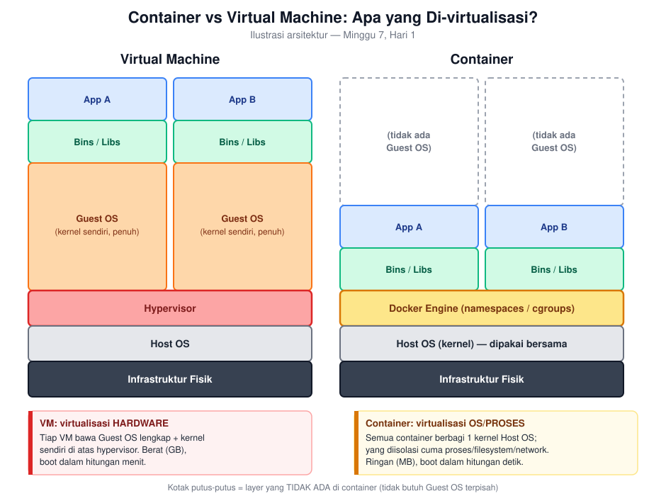
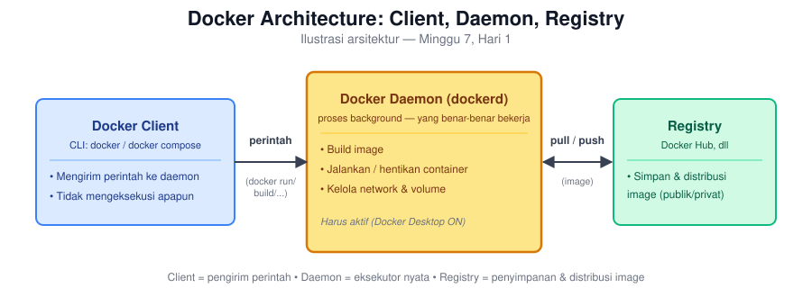

# Hari 1 — Container vs VM, Image vs Container, Docker Architecture

*Senin, 2 jam. Konsep murni — Docker sudah terpasang sejak Minggu 1, sesi ini menjelaskan apa yang sebenarnya terjadi di baliknya.*

## Tujuan Belajar

- [ ] Menjelaskan perbedaan fundamental container vs virtual machine (VM), termasuk konsekuensinya terhadap ukuran & kecepatan startup
- [ ] Membedakan konsep image vs container (blueprint vs instance yang jalan)
- [ ] Menjelaskan komponen Docker architecture: daemon, client, registry
- [ ] Menempatkan tools yang sudah dipakai sejak Minggu 1 (`postgres:16`, `apache/airflow:2.9.3`, `bitnami/kafka:3.7`) sebagai contoh image nyata

## Untuk Instruktur

Peserta sudah menjalankan puluhan `docker run`/`docker compose up` sejak Minggu 1 tanpa pernah benar-benar diminta memahami **kenapa** itu bekerja. Manfaatkan familiaritas itu — jangan mulai dari definisi abstrak, mulai dari pertanyaan "kenapa `docker run postgres:16` bisa langsung jalan tanpa install Postgres manual di laptop?" dan bangun konsepnya dari situ.

## Konsep & Sintaks

### Container vs Virtual Machine

Perbedaan paling fundamental: **apa yang di-virtualisasi**.



- **VM**: tiap VM punya **guest OS lengkap sendiri** (kernel sendiri) di atas hypervisor — isolasinya sangat kuat (level hardware-tervirtualisasi), tapi berat: tiap VM makan gigabytes disk, butuh menit untuk boot, overhead resource signifikan cuma untuk menjalankan OS-nya sendiri.
- **Container**: semua container di 1 mesin **berbagi kernel host OS yang sama** — yang diisolasi cuma proses, filesystem, dan network di level OS (lewat fitur Linux kernel: `namespaces` dan `cgroups`). Container cuma berisi aplikasi + library yang dibutuhkan, bukan OS lengkap — makanya ukurannya megabytes (bukan gigabytes) dan start dalam hitungan **detik**, bukan menit.

**Implikasi langsung yang sudah dirasakan sejak Minggu 1**: `docker compose up -d` untuk Airflow + Postgres + Kafka bisa menyalakan 5+ service dalam hitungan detik di 1 laptop — kalau itu 5 VM terpisah, laptop manapun akan kewalahan resource-nya. Ini alasan praktis kenapa container jadi standar untuk development lokal dan microservices, bukan cuma tren.

**Trade-off isolasi**: karena berbagi kernel host, container **tidak** bisa menjalankan OS yang beda kernel-nya dari host (container Linux tidak bisa jalan native di kernel Windows tanpa lapisan tambahan — inilah kenapa Docker Desktop di Mac/Windows sebenarnya menjalankan 1 VM Linux kecil di baliknya, transparan buat penggunanya). Isolasinya juga secara teori lebih "tipis" dari VM (berbagi kernel = potensi celah keamanan lintas container kalau ada bug kernel), meski dalam praktik container tetap dianggap cukup aman untuk mayoritas use case non-multi-tenant-ekstrem.

### Image vs Container

Analogi paling pas untuk developer: **image = class, container = instance/object**.

```python
class Postgres:          # <- image: blueprint, statis, disimpan di disk/registry
    ...

pg1 = Postgres()         # <- container: instance yang jalan, punya state sendiri
pg2 = Postgres()         # <- container lain dari image yang SAMA, state terpisah
```

- **Image** adalah **read-only template** — berisi filesystem lengkap yang dibutuhkan aplikasi jalan (OS minimal, dependency, kode). Disimpan sebagai serangkaian **layer** (dibahas detail di `hari_2_dockerfile.md`), dan **tidak berubah** selama tidak di-build ulang.
- **Container** adalah **instance yang sedang berjalan** dari sebuah image — punya proses aktif, state sendiri (data yang ditulis selama berjalan), dan bisa dihentikan/dihapus tanpa mempengaruhi image sumbernya.

Contoh nyata dari repo sendiri: `postgres:16` adalah **1 image**, tapi tiap kali `docker run postgres:16` dipanggil, itu membuat **container baru** — image-nya sendiri tidak pernah berubah, cuma jadi "cetakan" yang dipakai berulang.

```bash
docker images          # daftar image yang tersimpan lokal (blueprint)
docker ps -a           # daftar container, termasuk yang sudah berhenti (instance)
```

### Docker Architecture



- **Docker Client** — CLI (`docker`, `docker compose`) yang dipakai peserta selama ini, cuma **mengirim perintah** ke daemon.
- **Docker Daemon (`dockerd`)** — proses background yang **benar-benar** melakukan pekerjaan: build image, jalankan/hentikan container, kelola network & volume. Ini sebabnya Docker Desktop harus **menyala** (daemon aktif) sebelum perintah `docker` apapun bisa jalan — error "Cannot connect to the Docker daemon" yang sering muncul kalau Docker Desktop belum dibuka, sekarang jelas kenapa.
- **Registry** — tempat image disimpan & didistribusikan (Docker Hub jadi default publik). Saat `docker run postgres:16` dipanggil dan image itu belum ada lokal, daemon otomatis **pull** dari registry dulu — ini yang terjadi di balik layar tiap kali image "baru" langsung bisa dipakai tanpa instalasi manual.

## Kesalahan Umum

1. **Mengira container = "VM yang lebih ringan".** Bukan cuma soal ringan — bedanya arsitektural (berbagi kernel vs kernel sendiri), bukan sekadar optimasi ukuran dari konsep yang sama.
2. **Mengira menghapus container juga menghapus image-nya.** `docker rm <container>` cuma menghapus **instance**-nya; image tetap ada (`docker images` masih menunjukkannya), siap dipakai membuat container baru lagi.
3. **Bingung kenapa data hilang setelah container dihentikan lalu dijalankan ulang dengan `docker run` baru.** Setiap `docker run` dari image yang sama membuat container **baru** dengan state kosong (kecuali pakai volume — dibahas `hari_4_networking_volume.md`) — ini beda dari `docker start <container_id_lama>` yang melanjutkan container yang **sama**.
4. **Menjalankan Docker Desktop di Mac/Windows dan mengira containernya benar-benar "native Linux di atas macOS/Windows".** Seperti dibahas di atas, ada 1 VM Linux tersembunyi di baliknya — detail ini biasanya tidak perlu dipikirkan sehari-hari, tapi berguna dipahami saat debugging masalah performa/networking yang aneh di Mac/Windows dibanding Linux native.

## Latihan

1. Jelaskan ke rekan non-teknis (analogi bebas, tidak harus pakai istilah teknis): kenapa menjalankan 5 aplikasi database berbeda lewat Docker jauh lebih ringan dibanding menjalankan 5 VM terpisah untuk tujuan yang sama.
2. Jalankan `docker images` dan `docker ps -a` di terminal kamu (dari setup Minggu 1-6). Identifikasi: image mana yang jadi sumber container `pg-belajar`? Apakah image itu masih ada meski container `pg-belajar` sedang berhenti (`docker stop`)?
3. Kalau kamu `docker run` image `postgres:16` **dua kali** (dengan nama container beda), apakah kedua container itu saling berbagi data yang ditulis? Jelaskan kenapa berdasarkan konsep image vs container di atas.
4. Kenapa Docker Hub (dan registry pada umumnya) penting untuk workflow tim — bayangkan kamu dan rekan kerja butuh menjalankan environment development yang identik persis (versi Postgres, versi library) tanpa saling kirim file instalasi manual.

## Kunci Jawaban & Pembahasan

**1.** Analogi rumah kos vs rumah terpisah: VM itu seperti membangun **5 rumah terpisah lengkap** (masing-masing punya fondasi, listrik, saluran air sendiri) untuk 5 keluarga — mahal dan makan lahan besar walau tiap keluarga sebenarnya cuma butuh kamar untuk tidur. Container itu seperti **1 gedung kos** dengan 5 kamar — infrastruktur besar (fondasi, listrik, saluran air = kernel host) dipakai bersama, tiap penghuni (container) cuma punya ruang privat masing-masing (proses & filesystem terisolasi), jauh lebih efisien lahan & biaya untuk kebutuhan yang sama.

**2.** Image sumber `pg-belajar` adalah `postgres:16` (atau versi tag yang dipakai saat `docker run` pertama kali di Minggu 1). Ya, image `postgres:16` **tetap ada** di `docker images` meski container `pg-belajar` sedang berhenti — image adalah blueprint yang disimpan terpisah dari status hidup/mati container manapun yang dibuat darinya; `docker stop` cuma menghentikan proses container, tidak menyentuh image sama sekali.

**3.** **Tidak**, kedua container itu **tidak** otomatis berbagi data yang ditulis — masing-masing container punya filesystem instance sendiri yang terpisah (analogi: 2 objek berbeda dari class yang sama, tiap objek punya `self.data` sendiri-sendiri). Data yang ditulis di container pertama (misal lewat `INSERT INTO`) tidak akan terlihat di container kedua, walau keduanya lahir dari image `postgres:16` yang identik persis — kecuali keduanya sengaja dikonfigurasi memakai **volume yang sama** (`hari_4_networking_volume.md`), yang eksplisit menghubungkan penyimpanan di luar siklus hidup container itu sendiri.

**4.** Registry menyelesaikan masalah "works on my machine" untuk **infrastruktur**, bukan cuma kode — tanpa registry, tim harus mendokumentasikan manual "install Postgres versi X, dengan config Y" dan berharap semua orang mengikutinya identik (rawan drift versi). Dengan registry, cukup 1 baris `image: postgres:16` di `docker-compose.yml` (persis yang sudah dipakai sejak Minggu 1) — semua orang di tim, di mesin manapun, menjalankan **binary identik byte-per-byte** yang di-pull dari sumber yang sama. Ini juga alasan kenapa pinning versi (`postgres:16`, bukan `postgres:latest`) penting — dibahas lebih detail sebagai best practice di `hari_2_dockerfile.md`.
