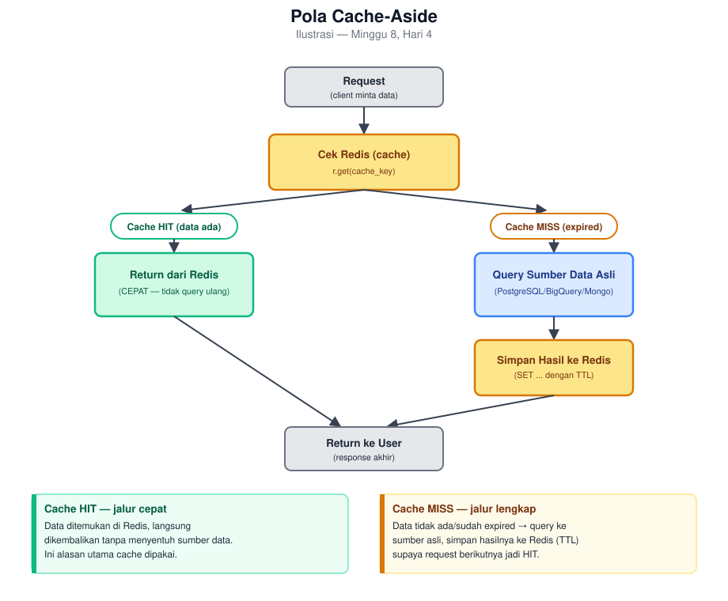

# Hari 4 — Redis Mendalam: Caching, Session Store, Rate Limiting

*Kamis, 2 jam. Persiapan langsung untuk Tahap 2 mini project Minggu (caching layer untuk query mahal).*

## Tujuan Belajar

- [ ] Menjelaskan kenapa Redis sangat cepat (in-memory) dan trade-off-nya (durabilitas)
- [ ] Menulis operasi dasar Redis dengan `redis-py`: string, hash, TTL/expiry
- [ ] Menjelaskan pola cache-aside (cek cache dulu, baru query sumber data)
- [ ] Menjelaskan use case lain Redis di luar caching: session store, rate limiting

## Untuk Instruktur

Sesi ini lebih ringan secara konseptual dibanding MongoDB (Redis modelnya sederhana) — manfaatkan waktu untuk **latihan pola cache-aside** secara mendalam, karena itu yang benar-benar dipakai di mini project Minggu, bukan cuma sekadar `SET`/`GET` dasar.

## Konsep & Sintaks

### Kenapa Redis Sangat Cepat

Redis menyimpan data **di memory (RAM)**, bukan disk — inilah sumber utama kecepatannya (RAM secara fundamental jauh lebih cepat diakses dibanding disk, termasuk SSD). Trade-off-nya: data di memory **rentan hilang** kalau proses Redis mati/restart, kecuali dikonfigurasi persistence (snapshot ke disk berkala, atau append-only log) — tapi bahkan dengan persistence aktif, filosofi Redis tetap "cepat dulu, durabilitas penuh itu kebutuhan sekunder" (beda dari Postgres yang durabilitas jadi prioritas utama sejak desainnya).

**Implikasi desain penting**: karena sifat ini, Redis **cocok untuk data yang boleh hilang** tanpa konsekuensi fatal (cache yang bisa dibangun ulang dari sumber aslinya) — **tidak cocok** sebagai satu-satunya tempat penyimpanan data yang tidak boleh hilang (`fact_sales` tetap harus ada di PostgreSQL/BigQuery, bukan cuma di Redis).

### Operasi Dasar dengan `redis-py`

```python
import redis
import json

r = redis.Redis(host="localhost", port=6379, decode_responses=True)

# String (paling sederhana)
r.set("greeting", "halo")
r.get("greeting")                    # "halo"

# TTL (Time To Live) -- otomatis terhapus setelah waktu tertentu
r.set("session:abc123", "user_42", ex=3600)   # expire dalam 3600 detik (1 jam)
r.ttl("session:abc123")              # sisa waktu (detik) sebelum expired

# Hash -- cocok untuk objek dengan beberapa field, tanpa perlu serialize manual per field
r.hset("product:85123A", mapping={"description": "T-LIGHT HOLDER", "price": "4.25"})
r.hgetall("product:85123A")          # {"description": "T-LIGHT HOLDER", "price": "4.25"}

# Menyimpan hasil query kompleks (list of dict) -- serialize ke JSON string dulu
r.set("cache:top_10_products", json.dumps([{"stock_code": "85123A", "revenue": 12000}, ...]), ex=3600)
cached = json.loads(r.get("cache:top_10_products"))
```

**Konvensi penamaan key**: pola `namespace:identifier` (`session:abc123`, `product:85123A`, `cache:top_10_products`) — bukan aturan teknis wajib, tapi konvensi yang sangat umum dipakai supaya key mudah dikelompokkan & di-debug, terutama saat Redis dipakai untuk banyak keperluan sekaligus dalam 1 instance.

### Pola Cache-Aside (Cache Miss / Cache Hit)

Ini pola **paling umum** dipakai untuk caching, dan yang akan diterapkan langsung di mini project Minggu:



```python
def get_top_10_products(engine, r: redis.Redis):
    cache_key = "cache:top_10_products"
    cached = r.get(cache_key)

    if cached is not None:
        print("Cache HIT")
        return json.loads(cached)

    print("Cache MISS -- query ke warehouse")
    df = pd.read_sql("""
        SELECT stock_code, description, SUM(revenue) AS total_revenue
        FROM fact_sales f JOIN dim_product p USING (stock_code)
        WHERE is_return = FALSE
        GROUP BY stock_code, description
        ORDER BY total_revenue DESC LIMIT 10
    """, engine)

    result = df.to_dict(orient="records")
    r.set(cache_key, json.dumps(result), ex=3600)   # cache 1 jam
    return result
```

**Kenapa TTL penting, bukan cache permanen**: data sumber (`fact_sales`) bisa berubah (pipeline Airflow jalan lagi, Minggu 3-4) — cache **tanpa** TTL berarti hasil lama bisa terus ditampilkan walau datanya sudah basi (stale cache). TTL memastikan cache otomatis "kadaluarsa" dan di-refresh dari sumber asli secara berkala, keseimbangan antara performa (tidak query ulang tiap request) dan kesegaran data (tidak basi selamanya).

### Use Case Lain: Session Store & Rate Limiting

**Session store** — menyimpan status login user (`session:<id> -> user_data`, dengan TTL sebagai auto-logout setelah tidak aktif) — sangat umum di aplikasi web, karena butuh akses **sangat cepat** tiap request untuk verifikasi (mirip pola `session:abc123` di atas).

**Rate limiting** — membatasi jumlah request per user/IP dalam periode waktu tertentu (mis. "maksimal 100 request per menit"):
```python
def is_rate_limited(r: redis.Redis, user_id: str, limit: int = 100, window_sec: int = 60) -> bool:
    key = f"rate_limit:{user_id}"
    current = r.incr(key)          # tambah counter, buat key baru kalau belum ada (mulai dari 1)
    if current == 1:
        r.expire(key, window_sec)  # set TTL cuma saat request PERTAMA dalam window ini
    return current > limit
```
`INCR` di Redis bersifat **atomic** (aman dari race condition walau banyak request datang bersamaan) — properti penting untuk use case seperti ini yang butuh hitungan akurat di bawah concurrency tinggi.

## Kesalahan Umum

1. **Menyimpan cache tanpa TTL sama sekali.** Cache jadi permanen "basi" kalau sumber data berubah tapi cache tidak pernah di-refresh — selalu tentukan TTL yang masuk akal untuk pola perubahan data sumbernya (data yang jarang berubah bisa TTL lebih lama, data yang sering berubah butuh TTL lebih pendek).
2. **Menganggap Redis bisa jadi pengganti database utama untuk data yang tidak boleh hilang.** Redis cocok untuk data yang **bisa dibangun ulang** dari sumber lain (cache) atau data sementara (session) — bukan tempat penyimpanan **satu-satunya** untuk data penting seperti `fact_sales`.
3. **Lupa serialize/deserialize untuk data kompleks.** Redis string cuma menyimpan **teks/bytes** — struktur data Python (list, dict) harus di-`json.dumps()` dulu sebelum `SET`, dan `json.loads()` lagi setelah `GET`, seperti contoh di atas.
4. **Cache stampede — banyak request bersamaan semua mengalami cache miss di saat yang sama** (mis. tepat saat TTL expired), semuanya lantas query ke sumber data secara bersamaan, membebani sumber data itu tiba-tiba. Solusi lanjutan (locking, staggered TTL) ada, tapi di luar cakupan mini project skala ini — cukup disadari sebagai risiko nyata di sistem production dengan traffic tinggi.

## Latihan

1. Jelaskan kenapa pola cache-aside di atas menyimpan hasil query **sebagai JSON string**, bukan langsung sebagai struktur Python — apa yang terjadi kalau kamu coba `r.set("key", [1, 2, 3])` langsung tanpa `json.dumps()` dulu?
2. Query RFM analysis (Minggu 1-2) dijalankan setiap ada yang membuka dashboard customer segmentation — cukup sering diakses, tapi datanya cuma benar-benar berubah setelah pipeline Airflow jalan (`@daily`, Minggu 3). TTL berapa yang masuk akal untuk cache ini, dan kenapa?
3. Rancang (pseudocode boleh) skema rate limiting yang membatasi API endpoint tertentu maksimal **20 request per menit per user** — jelaskan kenapa `INCR` dipilih dibanding `GET` lalu `SET` manual untuk menambah counter.
4. Kenapa Redis **tidak cocok** dipakai sebagai satu-satunya tempat menyimpan `fact_sales` (data transaksi penjualan), meski secara teknis Redis **bisa** menyimpan struktur data apapun sebagai string/hash?

## Kunci Jawaban & Pembahasan

**1.** Redis string secara native cuma menyimpan **teks/bytes**, tidak tahu apa itu "list Python" atau struktur data bahasa pemrograman tertentu — `json.dumps()` mengonversi struktur data Python jadi representasi teks universal (JSON) yang bisa disimpan sebagai string biasa, dan `json.loads()` mengonversinya balik. Kalau mencoba `r.set("key", [1, 2, 3])` langsung tanpa serialize, library `redis-py` akan **error** (`DataError`) — Redis command `SET` secara fundamental mengharapkan value berupa string/bytes, bukan objek Python kompleks.

**2.** **TTL sekitar 24 jam** (atau disesuaikan persis dengan jadwal `@daily` pipeline Airflow, Minggu 3) masuk akal — karena data sumber (`fact_sales`) **hanya** berubah setelah pipeline batch harian selesai jalan, tidak ada gunanya me-refresh cache lebih sering dari itu (query ulang ke database tanpa alasan, membebani sumber data secara tidak perlu). TTL yang **terlalu pendek** (mis. 5 menit) akan membuang manfaat caching (terlalu sering cache miss, query ulang padahal datanya belum berubah); TTL yang **terlalu panjang** (mis. 1 minggu) berisiko menampilkan data basi kalau ada perubahan mendadak di luar jadwal (mis. re-run manual pipeline). Idealnya, TTL cache disinkronkan dengan **frekuensi update data sumbernya yang sebenarnya**, bukan angka sembarang.

**3.**
```python
def check_rate_limit(r, user_id):
    key = f"rate_limit:{user_id}"
    count = r.incr(key)
    if count == 1:
        r.expire(key, 60)   # window 60 detik, cuma di-set saat request pertama
    return count <= 20      # True = boleh lanjut, False = ditolak (rate limited)
```
`INCR` dipilih karena bersifat **atomic** — dijamin oleh Redis sendiri sebagai 1 operasi utuh yang tidak bisa "terpotong" di tengah jalan walau banyak request datang **bersamaan** dari user yang sama (concurrency tinggi). Kalau memakai `GET` lalu `SET` manual (`current = r.get(key); r.set(key, int(current) + 1)`), ada celah waktu (race condition) antara `GET` dan `SET` di mana 2 request yang datang nyaris bersamaan bisa **sama-sama** membaca nilai lama sebelum salah satu sempat menulis nilai baru — hasilnya counter yang seharusnya bertambah 2 kali cuma bertambah 1 kali, rate limit jadi tidak akurat. `INCR` menghindari celah ini sepenuhnya karena dijamin atomic oleh Redis.

**4.** Redis **bisa** secara teknis menyimpan struktur seperti `fact_sales`, tapi **tidak cocok** karena: (1) **durabilitas** — Redis mengutamakan kecepatan di atas jaminan data tidak pernah hilang (sesuai pembahasan "Kenapa Redis Sangat Cepat" di atas); data transaksi penjualan historis adalah data yang **tidak boleh hilang** begitu saja kalau proses Redis crash, beda dari cache yang bisa dibangun ulang kapan saja dari sumber aslinya. (2) **kemampuan query** — Redis tidak punya kemampuan query analitik seperti SQL (`GROUP BY`, `JOIN`, window function yang sudah dipakai penuh sejak Minggu 1) yang justru krusial untuk analisis RFM/top produk; memaksakan analitik kompleks di atas Redis berarti menulis ulang logic itu secara manual di level aplikasi, kehilangan semua keunggulan SQL yang sudah matang. Redis paling optimal sebagai **lapisan tambahan** di depan sumber data yang memang dirancang untuk itu (PostgreSQL/BigQuery), bukan pengganti keduanya.
